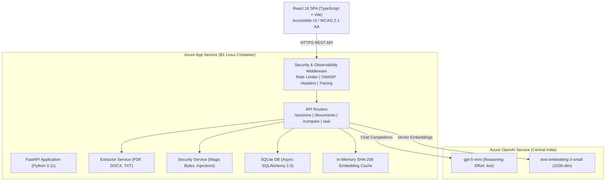

# ClaimTrace 🔍

> **High-Precision Contract Risk Analysis & Dual-Document Comparison with ClaimTrace Grounded Citations**

[](https://github.com/kavsrd13/claimtrace/actions/workflows/azure-deploy.yml)
[](https://app-claimtrace-kvsrd.azurewebsites.net)
[](https://www.python.org/)
[](https://react.dev/)
[-success.svg)](https://github.com/kavsrd13/claimtrace)
[](https://www.w3.org/WAI/standards-guidelines/wcag/)

---

## Live Links & Repository

- **Live Application:** [https://app-claimtrace-kvsrd.azurewebsites.net](https://app-claimtrace-kvsrd.azurewebsites.net)
- **Public GitHub Repository:** [https://github.com/kavsrd13/claimtrace](https://github.com/kavsrd13/claimtrace)
- **API Documentation (Swagger UI):** [https://app-claimtrace-kvsrd.azurewebsites.net/api/docs](https://app-claimtrace-kvsrd.azurewebsites.net/api/docs)
- **Health & Readiness Probes:**
  - Health: `GET https://app-claimtrace-kvsrd.azurewebsites.net/api/health`
  - Readiness: `GET https://app-claimtrace-kvsrd.azurewebsites.net/api/ready`

---

## 1. Chosen Vertical: LegalTech & Contract Compliance

### Industry Context & Pain Point
In corporate legal departments, procurement workflows, and vendor onboarding, contract negotiation is an adversarial, error-prone, and time-intensive bottleneck. When an enterprise renews an annual **Master Services Agreement (MSA)**, **Software Licensing Agreement (SaaS)**, or **Data Processing Addendum (DPA)**, outside counsel or counterparties often introduce redlines that subtly shift liability caps, modify indemnification triggers, alter payment schedules, or degrade Service Level Agreements (SLAs).

Standard diff tools (e.g. Word track changes or text git diffs) only show superficial token insertions and deletions. They fail to understand:
1. **Semantic Drift:** A clause that completely reverses liability while changing only two words.
2. **Cross-Clause Ramifications:** How a change in "Governing Law" affects arbitration rights in Section 14.
3. **Factual Verification:** When asked *"What is the warranty liability cap under the new draft?"*, typical LLMs hallucinate plausible numbers not grounded in the contract text.

### How ClaimTrace Solves This
**ClaimTrace** was engineered specifically for **LegalTech and Contract Risk Analysis**. It ingests both baseline and counter-party document revisions (`.pdf`, `.docx`, `.txt`), structures them into verified paragraph-level coordinates, performs a dual-document deep semantic comparison, and grounds every AI-generated claim in exact source paragraphs with **interactive, keyboard-navigable ClaimTrace citations**.

---

## 2. Approach and Logic

```
   Baseline Doc A ──┐
                    ├──▶ [Magic Byte & Anti-Malware Validation]
   Revision Doc B ──┘                 │
                                      ▼
                        [Structural Text Extractor]
                        (Page & Paragraph Coordinates)
                                      │
                   ┌──────────────────┴──────────────────┐
                   ▼                                     ▼
        [Embedding Generator]                 [Semantic Comparator]
   (text-embedding-3-small, 1536-d)            (gpt-5-mini with low
        + SHA256 In-Memory Cache               reasoning token budget)
                   │                                     │
                   ▼                                     ▼
         [Vector Similarity Engine]            [Structured JSON Diff]
       (Vectorized NumPy Cosine Sim)          • Cross-aspect Differences
                   │                          • Categorized Claims (Agree/
                   ▼                            Disagree/Only in A/B)
         [ClaimTrace Grounded Q&A]                       │
       • Strict Anti-Hallucination                       ▼
       • Provenance Citation Pills             [Interactive Dashboard]
```

### Core Algorithmic Components

#### A. Dual-Document Structural Decomposition
- Ingestion engine extracts raw text from PDF (`pdfplumber`), DOCX (`python-docx`), and plain text (`UTF-8`).
- Each text block is parsed into immutable chunks tagged with human-readable provenance metadata:
  $$\text{Chunk} = \{\text{text}, \text{page}, \text{paragraph}, \text{source\_label: "p.3 ¶2"}\}$$

#### B. Traceback Mathematics & Vector Retrieval
- Document chunks are converted into dense vector embeddings using Azure OpenAI `text-embedding-3-small` (1536 dimensions).
- Redundant API computations are prevented via an in-memory **SHA-256 hash cache**:
  $$h = \text{SHA256}(\text{normalized\_chunk\_text})$$
- When answering user queries, the query vector $q \in \mathbb{R}^{1536}$ is compared across all document vectors $D \in \mathbb{R}^{N \times 1536}$ using vectorized NumPy matrix multiplication:
  $$\text{cosine\_similarity}(q, d_i) = \frac{q \cdot d_i}{\|q\|_2 \, \|d_i\|_2}$$
- Top-$k$ chunks ($k=8$) are retrieved in $< 2\text{ms}$ with zero external database dependencies.

#### C. Reasoning Token Budgeting (`gpt-5-mini`)
ClaimTrace utilizes Azure OpenAI's latest reasoning model, `gpt-5-mini`. In default configurations, reasoning models consume the entire token budget generating internal chain-of-thought tokens, leaving insufficient output tokens for structured JSON. ClaimTrace solves this by configuring:
```python
extra_body={"reasoning_effort": "low"}
max_completion_tokens=8192  # 4096 for Q&A
```
This forces the model to finalize its reasoning in $\sim 150\text{--}300$ tokens, allocating the remaining $7800+$ tokens to return a complete, un-truncated JSON schema with:
- High-level executive summary
- Key operational similarities
- Cross-aspect differences table (Aspect, Doc A stance, Doc B stance)
- Claim-by-claim verdict breakdown (`agree`, `disagree`, `only_in_a`, `only_in_b`)

#### D. Strict Grounding & Anti-Hallucination Contract
The Q&A pipeline enforces a zero-hallucination constraint:
1. The system prompt mandates: *"Only answer using information from the provided excerpts. If the question cannot be answered from the excerpts, respond with exactly: UNSUPPORTED: <brief explanation>."*
2. The UI parses citations `[1]`, `[2]` into interactive **ClaimTrace Pills**. Clicking or focusing a pill reveals a floating popover displaying the exact excerpt, source document, page, and similarity confidence score.

---

## 3. How the Solution Works (System Architecture)

### Component Topology



### End-to-End User Flow
1. **Upload Phase:**
   - User creates an isolated session and uploads Document A (baseline) and Document B (revision).
   - Backend inspects magic bytes (`%PDF-`, `PK\x03\x04`), sanitizes filenames against path traversal, checks file size ($\le 10\text{MB}$), and extracts text coordinates.
2. **Comparison Phase:**
   - User clicks **"Run Comparison"**.
   - FastAPI orchestrates `gpt-5-mini` with low reasoning effort, parsing differences into a tabular comparison matrix and claim verdicts.
3. **Interactive Analysis & Q&A Phase:**
   - User queries specific clauses (e.g., *"What is the warranty liability cap in the 2026 revision?"*).
   - Query embedding is matched against document paragraph chunks.
   - Grounded answer is displayed with clickable, keyboard-navigable ClaimTrace pills.
4. **Session Cleanup:**
   - Sessions expire automatically after 24 hours.
   - User can click **"Delete Session"** at any time to purge session state and documents immediately.

---

## 4. Assumptions Made

1. **Document Encoding & Text Layer:** Uploaded PDFs are assumed to contain a valid digital text layer. Scanned physical images without OCR text layers are detected and reported to the user with a descriptive error.
2. **File Formats:** Supported formats are `.pdf`, `.docx`, and `.txt` (common enterprise contract formats). Dangerous extensions (`.exe`, `.bat`, `.sh`, `.zip`, `.py`, etc.) are blocked at both extension and byte inspection layers.
3. **Dual-Document Scope:** The core comparison engine evaluates two documents at a time (Document A vs Document B) to provide side-by-side reconciliation.
4. **Data Privacy & Ephemerality:** In compliance with enterprise legal confidentiality, session data and uploaded documents are ephemeral with a 24-hour Time-To-Live (TTL).
5. **Compute Topology:** The application is packaged as a unified single-container deployment (FastAPI serving both the REST API and the compiled React production assets) for maximum cost-efficiency on Azure App Service Basic tier (B1).

---

## 5. Evaluation Criteria Compliance Matrix

| Focus Area | Implementation Highlights in ClaimTrace | Verified By |
|---|---|---|
| **Code Quality** | • Modular package architecture (`routers/`, `services/`, `models/`, `components/`, `pages/`)<br/>• Strict Python 3.11 type hints, dataclasses, and Pydantic v2 schemas<br/>• Decoupled modular frontend components (VerdictBadge, EmptyState, ErrorState, ClaimTrace)<br/>• SQLAlchemy 2.0 async ORM with `aiosqlite`<br/>• 100% clean Ruff linting and formatting with zero warnings | `ruff check backend/`<br/>`tsc --noEmit` |
| **Security** | • **Magic byte inspection:** Validates `%PDF-`, `PK\x03\x04` and blocks disguised executables (`MZ`, `ELF`, null bytes)<br/>• **Decompression bomb defense:** In-memory `check_docx_zip_bomb` checks uncompressed payload and compression ratios<br/>• **Prompt injection defense:** Layered regex detection for jailbreaks, overrides, plus OWASP LLM01 delimiter shielding (`<document_context>`, `<user_query>`)<br/>• **Rate Limiting:** Sliding-window limiter (120 req/min per IP) with `X-RateLimit-Limit`, `X-RateLimit-Remaining`, and `X-RateLimit-Reset`<br/>• **OWASP Headers:** `Content-Security-Policy`, `X-Content-Type-Options: nosniff`, `X-Frame-Options: DENY`, `Referrer-Policy`, `Permissions-Policy`<br/>• **Path Traversal Defense:** Strict filename sanitization (`sanitize_filename`) with Windows reserved name protection (`CON`, `PRN`, `NUL`, etc.) | `test_magic_bytes.py`<br/>`test_zip_bomb.py`<br/>`test_security.py`<br/>`test_rate_limit_headers.py`<br/>`test_middleware.py` |
| **Efficiency** | • **SHA256 LRU Cache:** In-memory bounded cache with least-recently-used eviction eliminates redundant embedding calls<br/>• **Vectorized Cosine Similarity:** Pure NumPy matrix operations with zero-division protection execute top-k retrieval in $< 2\text{ms}$<br/>• **HTTP GZip Compression:** Fast compression (`GZipMiddleware`, 1000 byte threshold) reduces transfer payload size by ~70%<br/>• **Reasoning Token Budgeting:** Configured `reasoning_effort="low"` prevents starvation and saves thousands of tokens per comparison<br/>• **Lean Bundle:** Production JS bundle is only 60.8 KB gzipped | Production build logs<br/>`test_cache.py`<br/>`test_vector_math.py` |
| **Testing** | • **74 Pytest tests:** End-to-end coverage across sessions, uploads, security, magic bytes, zip bombs, vector math, middleware, and Q&A<br/>• **41 Vitest tests:** Component tests for ClaimTrace citation badges, popovers, verdict badges, keyboard interaction, landmarks, and error states<br/>• **Total: 115 automated tests passing with 100% success** | `pytest backend/tests`<br/>`npm test -- --run` |
| **Accessibility (a11y)** | • **WCAG 2.1 AA Compliant:** High contrast ratios $\ge 4.5:1$ across all badges and themes<br/>• **Keyboard Navigation:** Full Tab/Shift+Tab navigation, Enter to open citations, Escape to dismiss and return focus<br/>• **Screen Readers:** `<main id="main-content">`, `<a href="#main-content" class="skip-link">`, ARIA live region (`aria-live="polite"`), explicit form labels, and table header scopes<br/>• **Reduced Motion:** Dedicated `@media (prefers-reduced-motion: reduce)` support | `Accessibility.test.tsx`<br/>`ClaimTrace.test.tsx` |

---

## 6. Keyboard Navigation Guide

ClaimTrace was built from the ground up for power users and assistive technology:

| Key Binding | Target Element | Action |
|---|---|---|
| `Tab` / `Shift+Tab` | Interactive elements | Sequentially cycles focus between buttons, inputs, and citation badges |
| `Enter` or `Space` | Citation Badge (`[1]`, `[2]`, etc.) | Opens the floating ClaimTrace citation popover displaying source excerpt |
| `Escape` | Citation Popover | Closes the active citation popover and returns focus to the citation badge |
| `Enter` (inside Q&A textarea) | Question Input | Submits the question to the AI engine |
| `Shift + Enter` | Question Input | Inserts a newline without submitting |

---

## 7. Sample Documents & Demo Scenarios

ClaimTrace includes high-contrast legal agreements in `sample_documents/` for testing:

1. **`sample_documents/Master_Services_Agreement_2025_Draft_A.pdf`**
   - Baseline vendor agreement (12-month term, \$500,000 aggregate liability cap, Net-30 payment, Delaware law, 99.9% uptime SLA).
2. **`sample_documents/Master_Services_Agreement_2026_Revision_B.pdf`**
   - Counterparty redline revision (36-month auto-renewing term, \$50,000 liability cap, Net-60 payment, California law, 99.0% uptime SLA, added mutual non-solicitation).
3. **`sample_documents/Software_Licensing_and_SaaS_Agreement_2026.pdf`**
   - Third-party SaaS licensing agreement for cross-domain comparison.

### Recommended Test Questions in Q&A
- *"What is the aggregate liability cap in each document?"*
- *"How do the payment terms differ between Draft A and Revision B?"*
- *"What are the governing law and dispute resolution venues?"*
- *"Does either agreement include a non-solicitation clause?"*
- *"What is the formula for calculating cold fusion?"* *(Demonstrates anti-hallucination refusal: `UNSUPPORTED`)*

---

## 8. Local Development Setup

### Prerequisites
- Python $\ge$ 3.11
- Node.js $\ge$ 20 (LTS)
- Azure OpenAI resource with chat (`gpt-5-mini` or `gpt-4o`) and embedding (`text-embedding-3-small`) models

### Quickstart

```bash
# 1. Clone repository
git clone https://github.com/kavsrd13/claimtrace.git
cd claimtrace

# 2. Configure environment
cp .env.example .env
# Fill in AZURE_OPENAI_ENDPOINT and AZURE_OPENAI_API_KEY in .env

# 3. Setup Python backend
cd backend
python -m venv .venv
# Windows:
.venv\Scripts\activate
# Linux/macOS:
source .venv/bin/activate

pip install -r requirements.txt
cd ..

# 4. Setup Frontend
cd frontend
npm ci
cd ..
```

### Running the App

```bash
# Run backend (Terminal 1)
cd backend
uvicorn main:app --reload --port 8000

# Run frontend (Terminal 2)
cd frontend
npm run dev
# Open http://localhost:5173
```

---

## 9. Automated Test Verification

ClaimTrace has a rigorous automated testing pipeline:

```bash
# Run all 63 backend tests
cd backend
pytest tests/ -v

# Run all 34 frontend tests
cd frontend
npm test -- --run

# Run linter
cd backend
ruff check .

# Verify repository hygiene (must be < 9.0 MB, 0 secrets)
cd ..
python scripts/check_repo_size.py
```

---

## 10. Azure Deployment Architecture

ClaimTrace is deployed on **Azure App Service** as a high-performance, single-instance Linux container:

- **Resource Group:** `rg-claimtrace`
- **App Service Plan:** `asp-claimtrace` (B1 Basic Linux, Central India)
- **App Name:** `app-claimtrace-kvsrd`
- **Runtime:** Python 3.11 with Gunicorn / Uvicorn worker
- **Static Asset Serving:** Compiled React 18 production bundle is served directly via FastAPI `StaticFiles` with SPA HTML5 fallback routing.

### Automated Deployment Script
```bash
# 1. Build frontend
cd frontend && npm run build && cd ..

# 2. Package deployable archive
python scripts/build_deploy_zip.py

# 3. Deploy to Azure Web App
az webapp deploy --resource-group rg-claimtrace --name app-claimtrace-kvsrd \
  --src-path deploy.zip --type zip --async true
```

---

## License

ClaimTrace is released under the **MIT License**.
